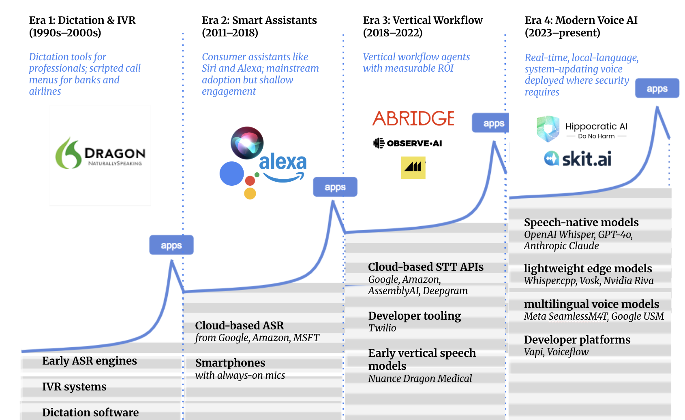

# Voice AI Investment Thesis

One of the last features I launched before leaving Google Search was multimodal querying with Gemini in Search — layering voice on top of video or images for contextually rich queries. Building the demo was 
incredibly difficult. We had to use-case mine i.e. evaluate hundreds of scenarios for which the technology could accurately capture multimodal context and give a good output. Voice has come a long way since then.

Over the past year, I've noticed myself reaching for voice-first modalities more and more often. It started with using Speechify to prepare for HBS case discussions, then evolved into a preference for voice input in Claude and GPT when relaying unstructured, stream-of-consciousness thoughts my brain processed faster than my fingers could type. My classmates said the same.

The reality is, voice is graduating from finicky consumer novelty to workflow infrastructure. I put together this thesis to concretize my thinking.

---

**Thesis TL;DR**
The voice winners will be vertical applications that act in core systems, hit sub-250ms latency, and deliver measurable, audited business outcomes.

---

**Why now**
Three things are converging:
- Speech-native stacks now deliver human-level accuracy at sub-250ms response times
- Developer tooling (Vapi, Voiceflow) is finally enterprise-ready
- The classic apps-infrastructure flywheel is in motion — applications are driving further advances in accuracy, privacy, and cost

---

**Three investment themes**

**01 — Regulated Agent Assist**
In high-penalty workflows like healthcare prior auth, insurance claims, and financial disputes, voice AI's role is to assist rather than replace. Tools that boost accuracy and compliance while keeping humans in control will see rapid adoption.

**02 — Sovereign-Grade Deployment**
As voice AI moves into the core of regulated workflows, buyers demand deployment flexibility — zero-egress cloud, sovereign infrastructure, or on-premise — without losing features. Privacy and deployment choice are the wedge.

**03 — Voice-First Finance in Emerging Markets**
Multilingual models now handle code-switching, accents, and low-quality phone audio well enough to power high-stakes financial conversations in markets like East and West Africa. The opportunity is large and undercapitalized.

---

**Key players mapped**
Covers the full stack from foundational models to vertical applications — including ElevenLabs, Vapi, Voiceflow, Abridge, Nabla, Observe.ai, Sameday AI, Hippocratic AI, HappyRobot, and Lengo.ai.

---

**About**
Independent research at the intersection of AI investing and emerging markets. Written with a VC lens, informed by product experience.

📎 [LinkedIn](https://linkedin.com/in/princess-adentan-85989199)

